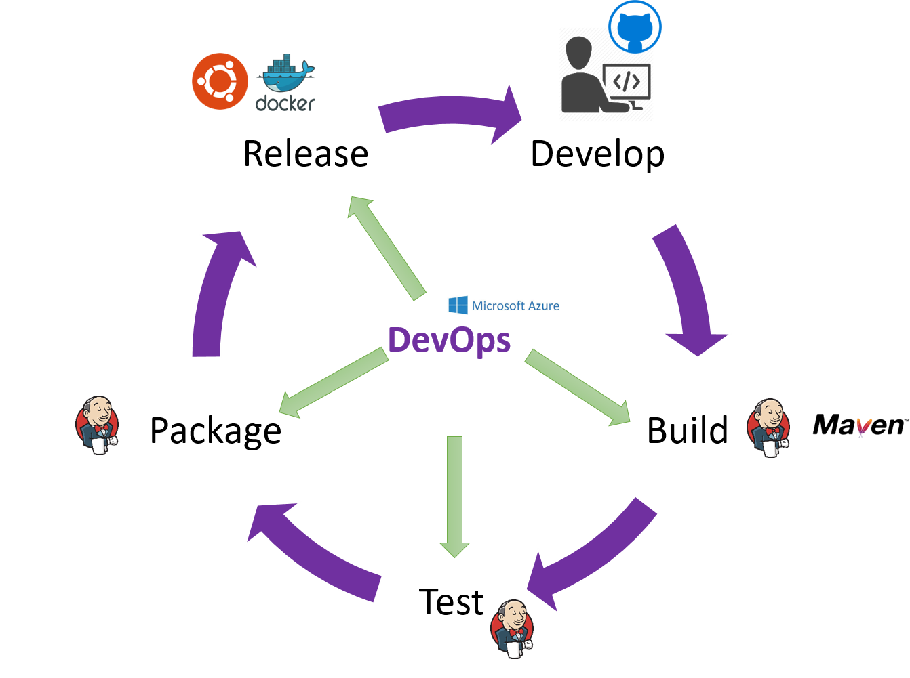
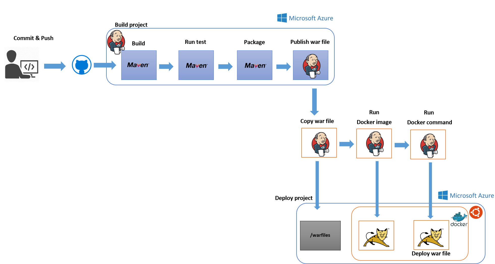

# 1. Introduction
In this workshop you will implement an example of continuous build and deployment of containerized Java Web applications using Linux, Maven, Tomcat, Jenkins, Docker and Eclipse on Azure; this is a classic DevOps scenario and here you will learn how to build a DevOps lifecycle from scratch.

Today everyone is looking for try/learn/automate/experiment in the simplest way possible how to implement/deploy in a DevOps scenario on cloud architecture.

To get more information about each tool [check it here](https://xebialabs.com/the-ultimate-devops-tool-chest/)

## Components
In this HOL, you will use 1 Virtual Machine with the next features.

Jenkins Continuous Integration and Delivery server on Azure. This Deployment results in the following offerings being installed:  
* Ubuntu 16.04.0-LTS (amd64 20160627) Virtual Machine by Canonical, Inc  
* Docker Engine 
* Jenkins Engine

## Workflow 

1. Using your favorite IDE, you will create and update a Sample Java Web application.
2. Jenkins will detect a commit on Github repository and triggered a new build
3. Jenkins starts a Maven build and publish the war file created
4. Docker pull and install a Tomcat container 
5. Download the war file to an Ubuntu directory in your VM
5. Deploy the war file in the Tomcat container
7. The Java Web Application is deployed in Tomcat and accesssible through a Web browser

