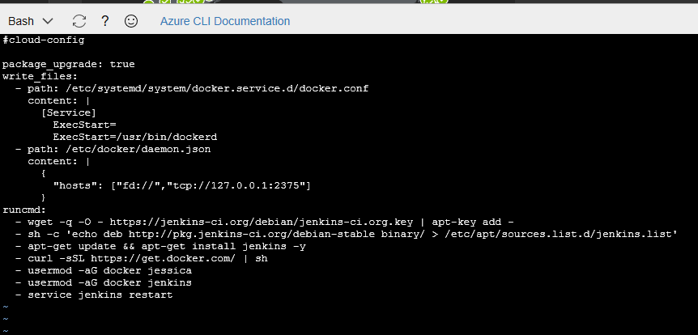

# 2. Creating and configuring a Jenkins server in Azure

## 2.1 Overview
In this lab, we will setting up Jenkins to use it in our HOL-Devops project.

### 2.1.1 Objectives
This lab aims to get you familiar with Jenkins and Docker on Azure Cloud.

### 2.1.2 Requirements
You must have the Azure account mentioned in the README file.

## 2.2 Creating a VM in Azure running Jenkins

1. Browse to the Azure Portal: https://portal.azure.com/

   [//]: <> (For this lab we will use Jenkis template published by Docker. This will setup an Ubuntu VM with the Docker engine installed and a Jenkins container running on it.)

   For this lab we will set up an Ubuntu VM with Docker and Jenkins engines installed.
    
    [//]:<> (2. Click Create to begin the creation of the VM.)

2. Browse to the right side of Azure portal and open the Cloud Shell tool

    

    


3. Create cloudInitJenkins.txt file

     

    ```
    user@Azure vi cloudInitJenkins.txt
    ``` 
   

Copy the following contents:
    
    #cloud-config
    package_upgrade: true
    write_files:
    - path: /etc/systemd/system/docker.service.d/docker.conf
        content: |
        [Service]
            ExecStart=
            ExecStart=/usr/bin/dockerd
    - path: /etc/docker/daemon.json
        content: |
        {
            "hosts": ["fd://","tcp://127.0.0.1:2375"]
        }
    runcmd:
    - wget -q -O - https://jenkins-ci.org/debian/jenkins-ci.org.key | apt-key add -
    - sh -c 'echo deb http://pkg.jenkins-ci.org/debian-stable binary/ > /etc/apt/sources.list.d/jenkins.list'
    - apt-get update && apt-get install jenkins -y
    - curl -sSL https://get.docker.com/ | sh
    - usermod -aG docker youruser
    - usermod -aG docker jenkins
    - service jenkins restart
    

4. Create the resource group 

    

    ```
    user@Azure:~$ az group create --name yourresourcegroup --location westeurope  
    ```

5. Create the VM

    

    ```
    user@Azure:~$ az vm create --resource-group yourresourcegroup --name yourVM --image UbuntuLTS --admin-username youruser --generate-ssh-keys --custom-data cloudInitJenkins.txt
    ```
## 2.3 Configuring VM's Network Interface

1. Add "Inbound security rules"

    ```
    user@Azure:~$ az vm open-port --resource-group yourresourcegroup --name yourVM  --port 8080 --priority 1001
    user@Azure:~$ az vm open-port --resource-group yourresourcegroup --name yourVM  --port 8888 --priority 1002
    ```

## 2.4 Unlock Jenkins

1. Login into yourVM

    

    ```
    user@Azure:~ ssh youruser@yourVMIP
    ```
2. Validate Docker installation

    ```
    youruser@yourVM:~$ docker -v
    ```

3. Validate Jenkins installation

    ```
    youruser@yourVM:~$ service jenkins status
    ```

4. In order to access the Administrator's password used to unlock Jenkins run the following command:

    ```
    youruser@yourVM:~$ sudo more /var/lib/jenkins/secrets/initialAdminPassword
    ```

5. When you log in to Jenkins for the first time, it will ask you to unlock it. To unlock, provide the initialAdminPassword and continue to the next step.
    

6. Select "Install suggested plugins" and wait for the installation to complete.
     
7. Create a new admin user in Jenkins by filling out the following fields and clicking "Save and Finish"
   

13. Once you have created a new user, Jenkins is ready! Click "Continue as your-user" to proceed.
    
## 2.5 Setting up Jenkins

### 2.5.1 Install plugins
   
1. To create our build and deploy we will need install the SHH and Copy Artifact plugins. 

    Browse to Manage Jenkins-> Manage Plugins
   
2. Select the "Available" tab to view all available plugins and mark the "SSH plugin and Copy Artifact plugin" for download. Click "Install without restart" to install the plugin.
     

### 2.5.2 Maven Configuration

1. Go to the Jenkins Dashboard and select "Manage Jenkins". Browse to Global Tool Configuration->Maven->Add Maven

2. Fill in Maven settings and Save the configuration
    **Name:** "your-maven-installation"  
    **Check Install automatically**  
    **Install from Apache**  

    

