# 2. Creating and configuring a Jenkins server in Azure

## 2.1 Overview
In this lab, we will setting up Jenkins to use it in our HOL-Devops project.

### 2.1.1 Objectives
This lab aims to get you familiar with Jenkins on Azure Cloud.

### 2.1.2 Requirements
You must have the Azure account mentioned in Lab 01.

## 2.2 Creating a VM in Azure running Jenkins

1. Browse to the Azure Portal: https://portal.azure.com/

   For this lab we will use Jenkis template published by Docker. This will setup an Ubuntu VM with the Docker engine installed and a Jenkins container running on it.
     
2. Click Create to begin the creation of the VM. 
    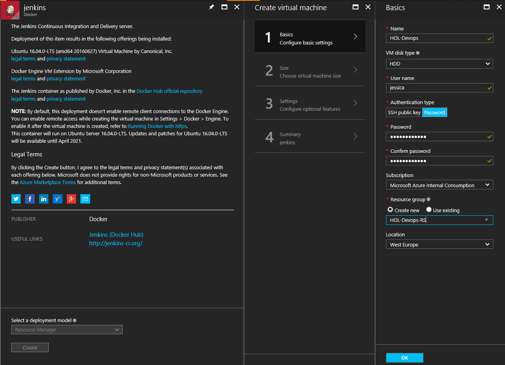

3. Fill in the basic machine settings:

    **Name:** HOL-Devops  
    **VM Disk Type:** HDD  
    **Username:** jessica  
    **Authentication type:** Password  
    **Password:** Choose a password you will remember  
    **Subscription:** Your Azure subscription  
    **Resource group:** (Create new) HOL-Devops-RS  
    **Location:** Your preferred Location

    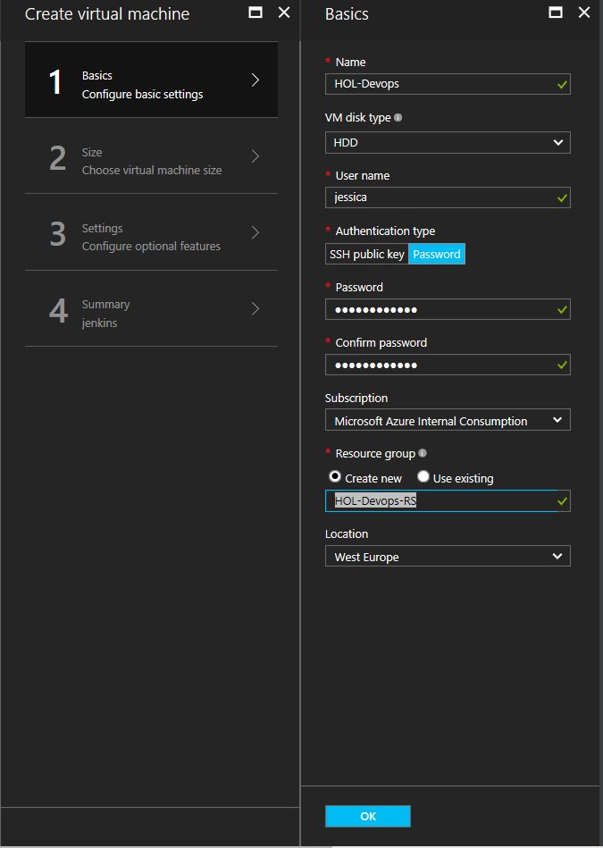

4. Select the "A1 Standard" virtual machine size. If you are unable to see this machine size, make sure you are viewing "All" machine sizes and not only those that are "Recommended" (you can toggle this view in the upper right corner of the machine size viewer).
    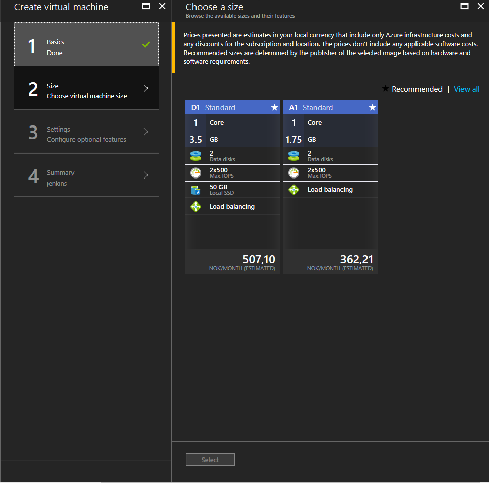 

5. In the third step you can select optional extensions to be installed, but we will simply leave this as-is and select OK to move to the next step.  

   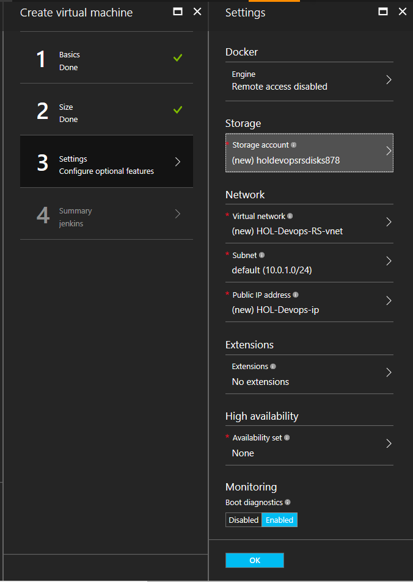

6. Validate the configuration settings you've seected and click OK. 
    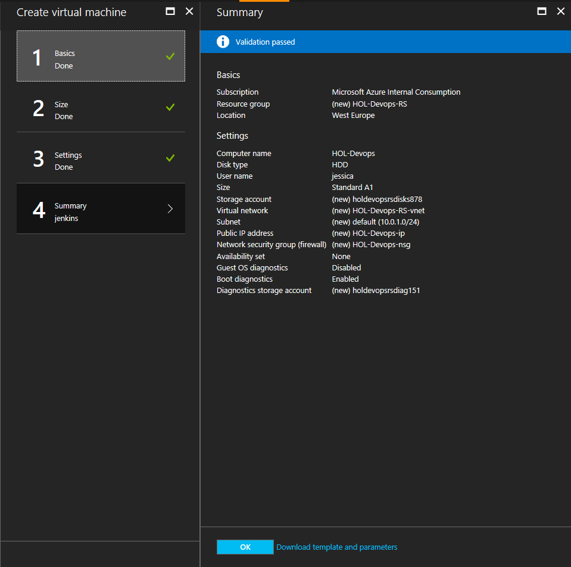

7. The machine will now be deployed for you: 
    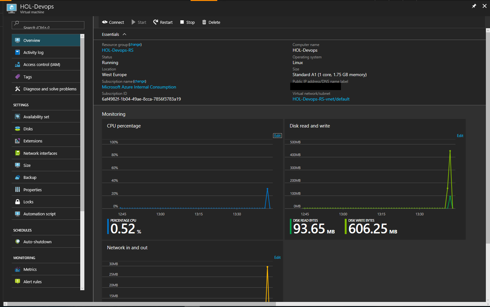

## 2.3 Configure Network Interface

1. Go to the machine that you just create in the previous section, in the left menu, select "Network interfaces"
    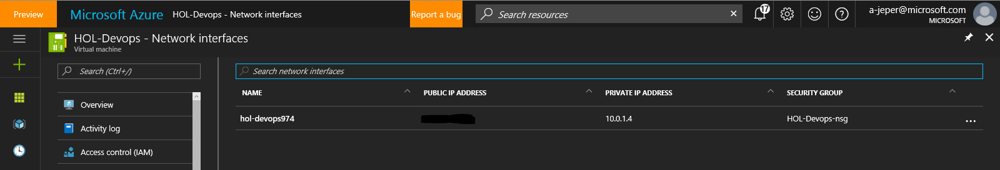

2. Select "Network interfaces"  and open **your-network-interface** and then  open "Network segurity group"

    For this lab the network interface is **hol-devops97**
    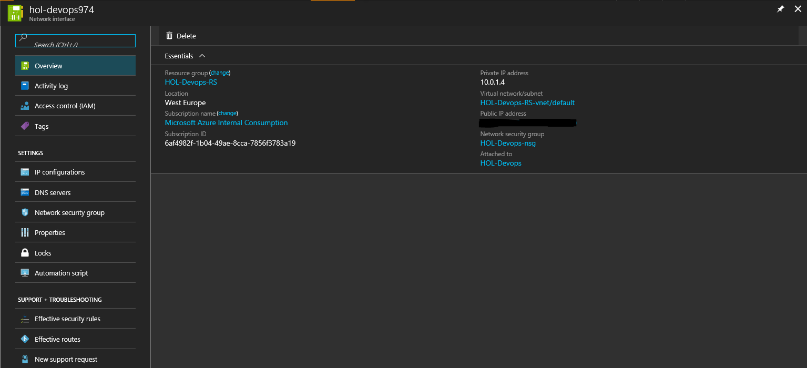

    For this lab the network security group is **HOL-Devops-nsg**
    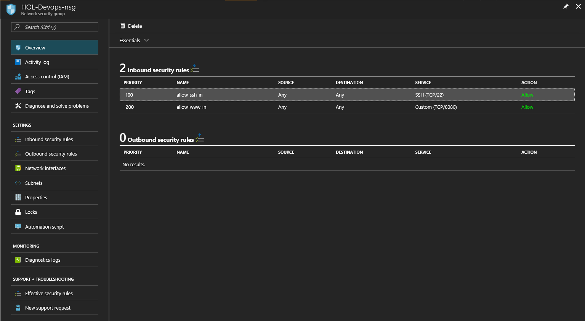 

3. In the left menu, select and open "Inbound security rules" and "Add" a new rule 

    Fill in the rule settings:
    **Name:** tomcat  
    **Priority:** 300  
    **Source:** Any  
    **Service:** Custom  
    **Protocol:** TCP  
    **Port range:** 8888  
    **Action:** Allow  

    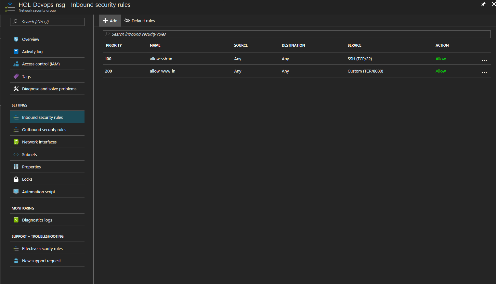

    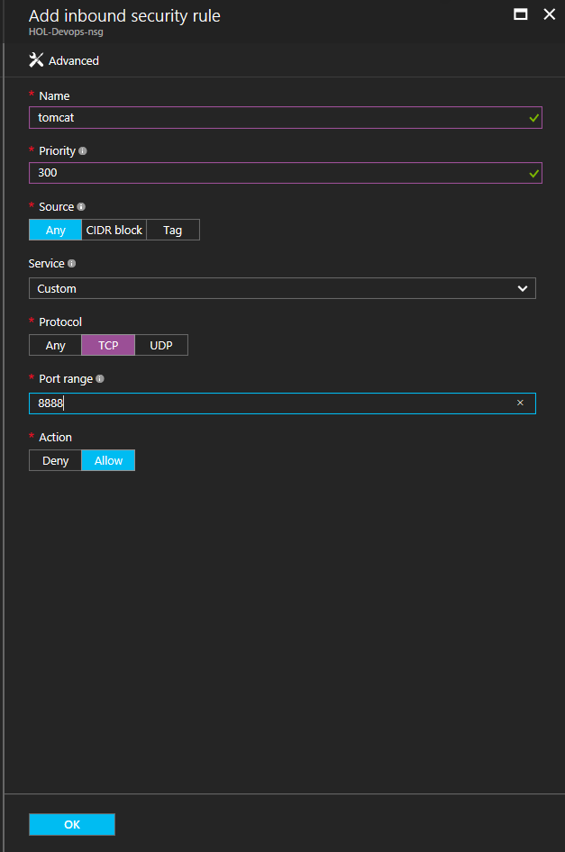

    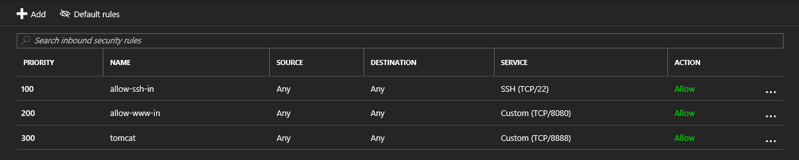

## 2.4 Unlock Jenkins

1. Go to http://{your-public-ip}:8080 to access Jenkins
   
2. When you log in to Jenkins for the first time, it will ask you to unlock it. To unlock, we will connect directly to the machine that Jenkins in installed on and retrieve the password.
    

3. If you don't have PuTTY already, [download the PuTTY client here](http://www.putty.org/).

4. Run the PuTTY.exe file to start the client. 

5. Enter the public IP address from step 2 into the "Host name (or IP address) textbox" and click "Open" to connect to the machine.

    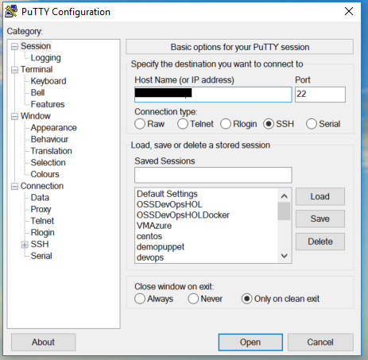
   
6. When asked, type in the username and password you specified when you created the virtual machine in section 2.2 of this lab. 
   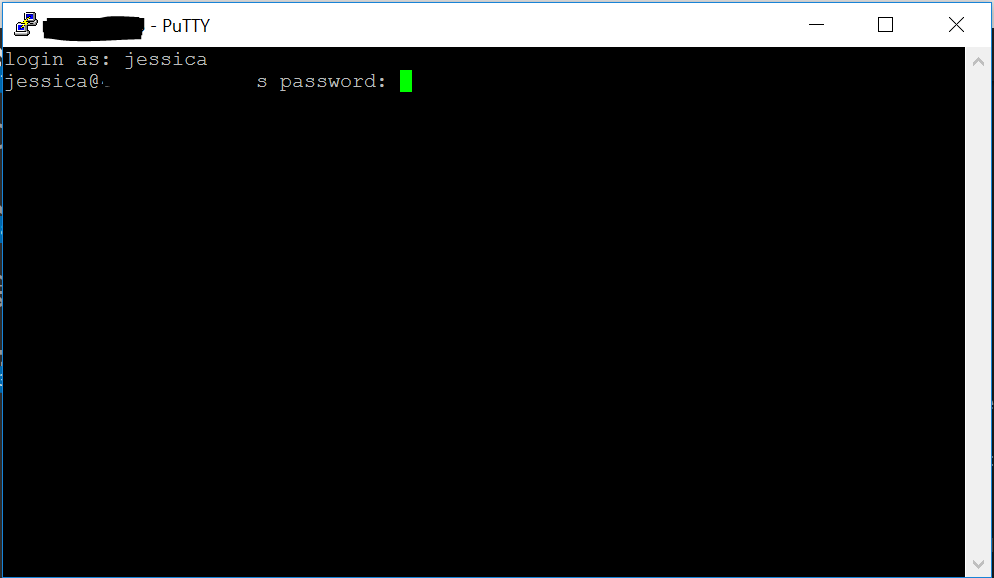
   
7. In order to access the Administrators password used to unlock Jenkins, we need to access the Docker container in which Jenkins is installed. List all containers by running the following command:

    ```
    docker ps
    ``` 

8. Now that we have the container ID of the Jenkins container, we can access its logs by running the following command: 

    ```
    docker logs {containerID}
    ```

9. You will now see the Administrator password required to unlock Jenkins: 
      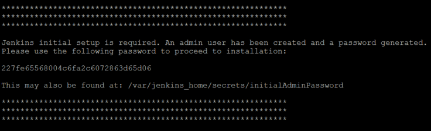

10. Provide the Administrator password and continue to the next step.
  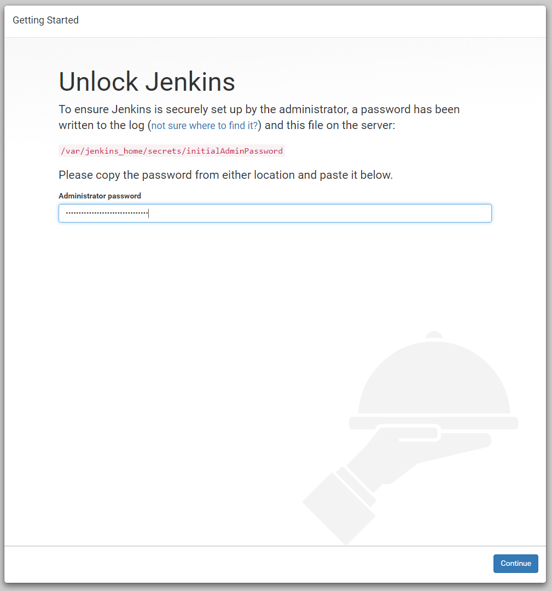

11. Select "Install suggested plugins" and wait for the installation to complete.
     
12. Create a new admin user in Jenkins by filling out the following fields and clicking "Save and Finish"
   

13. Once you have created a new user, Jenkins is ready! Click "Continue as your-user" to proceed.
 
## 2.5 Configure communication between Jenkins and Docker

1. In order to configure the communication we will run the next commands in the console:

    ```
    ifconfig //notice your private IP
    docker ps
    docker exec -it {container ID} bash
    user@{Container ID}:/$ ping 172.17.0.1 //check communication with Host
    user@{Container ID}:/$ ping 10.0.1.4 //check communication with private IP
    user@{Container ID}:/$ ssh-keygen   //Generating public/private rsa key pair.
    user@{Container ID}:/$ ssh jessica@10.0.1.4 sudo docker run hello-world //validate docker and ssh connection
    user@{Container ID}:/$ ssh-copy-id jessica@10.0.1.4 //copy the keys
    user@{Container ID}:/$ ssh jessica@10.0.1.4 sudo docker run hello-world //valide the connection
    user@{Container ID}:/$ exit //exit from container
    ```
    
    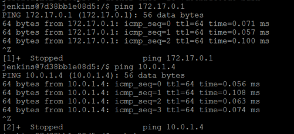

    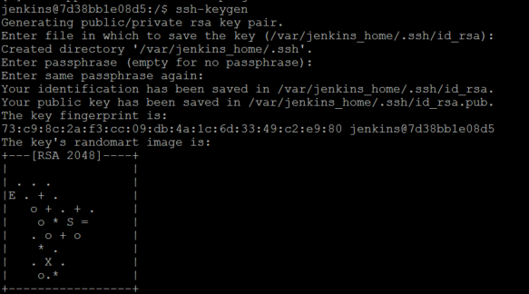

    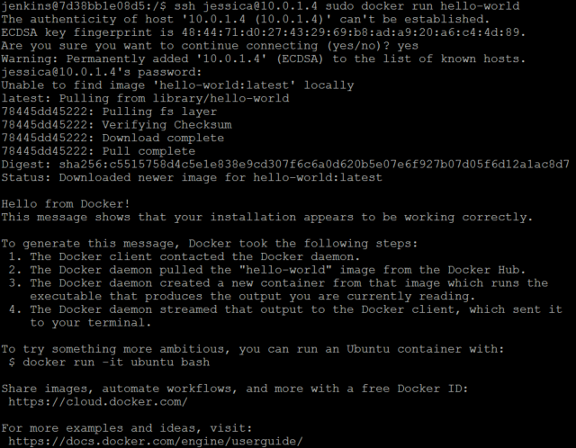

    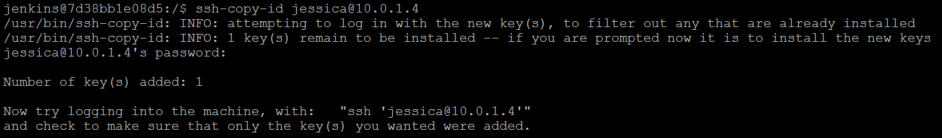

    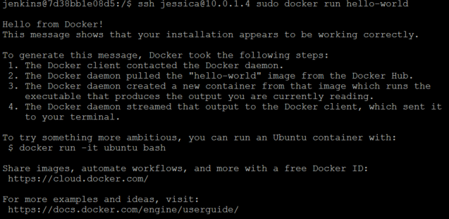
    
## 2.6 Configuring a Maven build in Jenkins

### 2.6.1 Install maven plugins
   
1. To create our build and deploy we will need install the SHH and Copy Artifact plugins. 

    Browse to Manage Jenkins-> Manage Plugins
   
2. Select the "Available" tab to view all available plugins and mark the "SSH plugin and Copy Artifact plugin" for download. Click "Install without restart" to install the plugin.
     

### 2.6.2 Maven Configuration

1. Go to the Jenkins Dashboard and select "Manage Jenkins". Browse to Global Tool Configuration->Maven->Add Maven

2. Fill in Maven settings and Save the configuration
    **Name:** "your-maven-installation"  
    **Check Install automatically**  
    **Install from Apache**  

    

