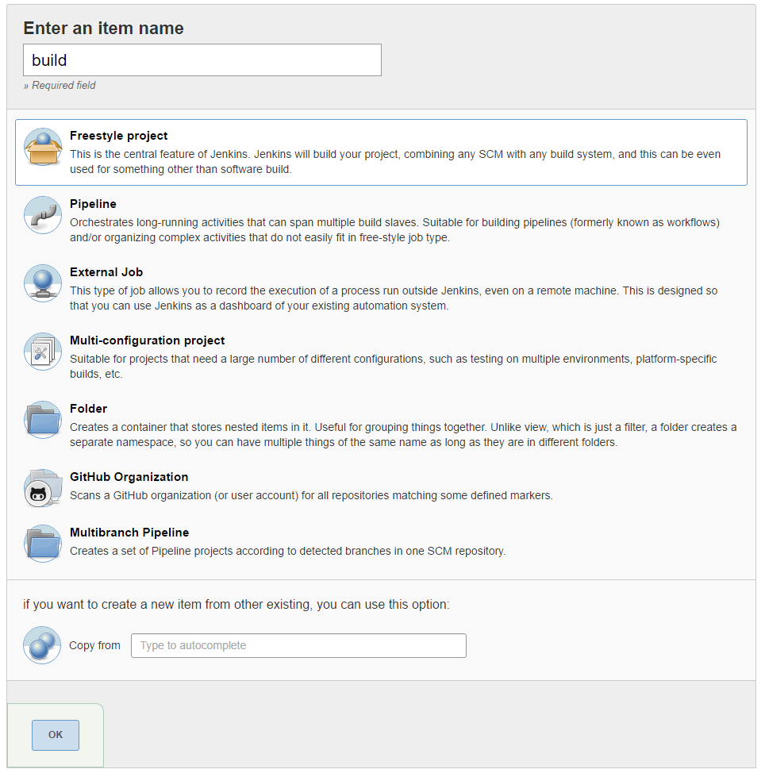
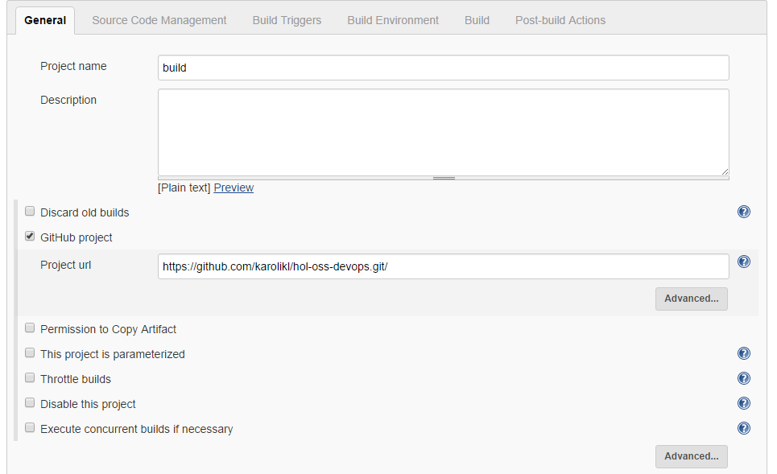
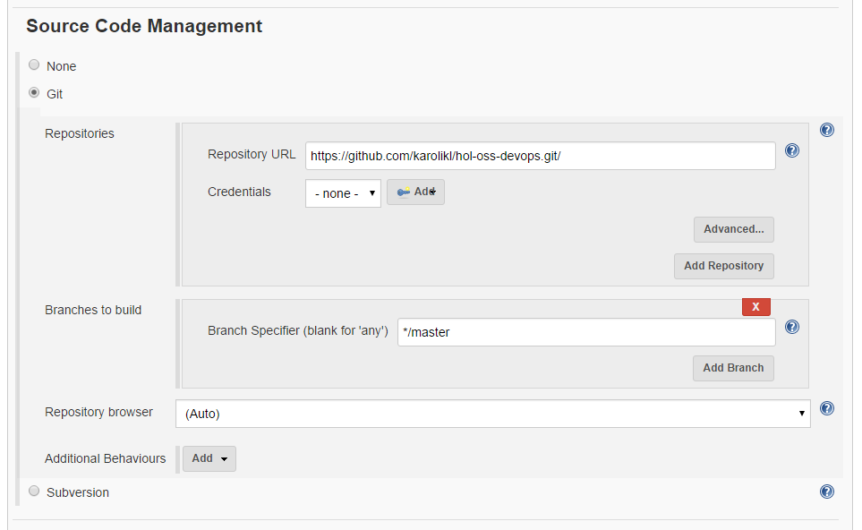
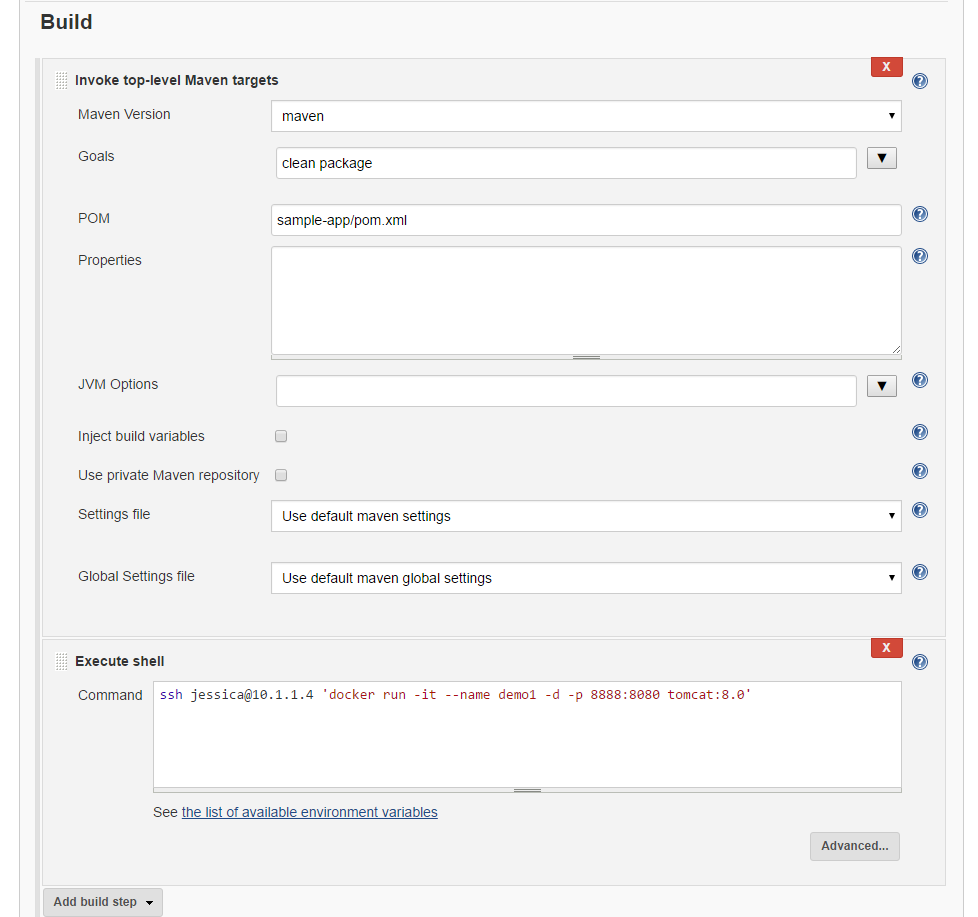
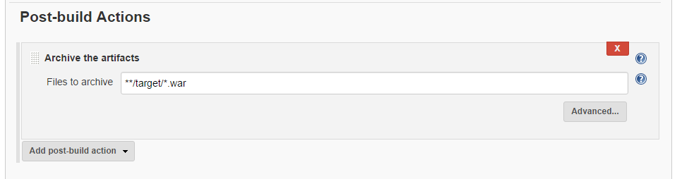
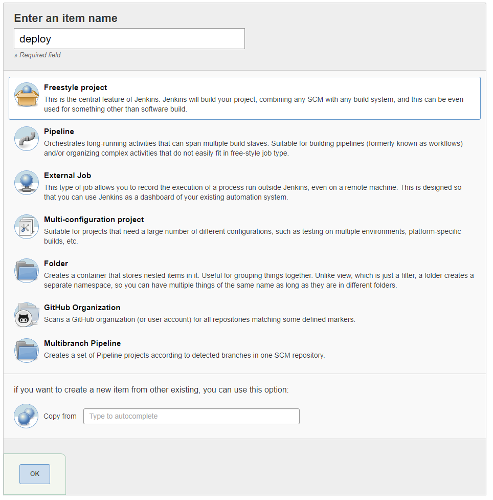
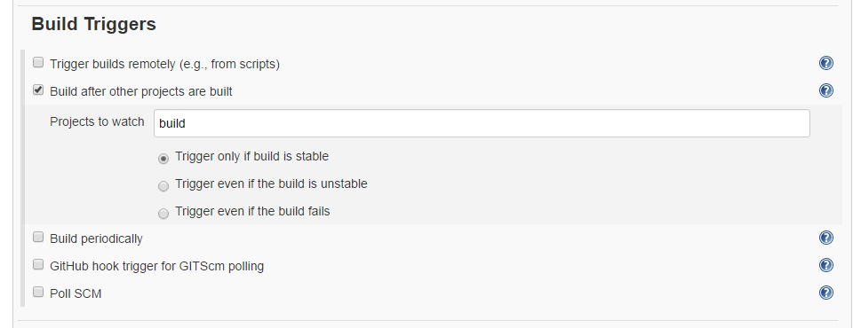
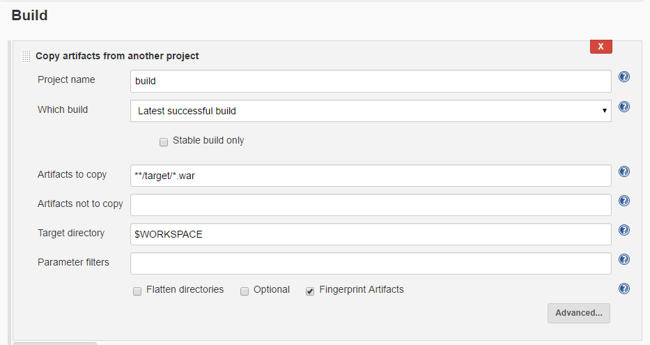
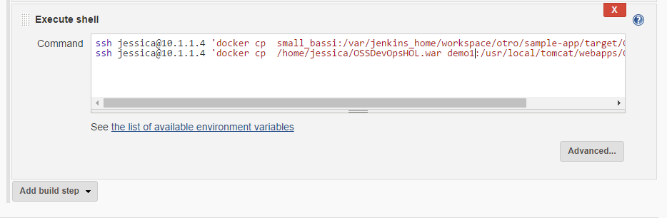
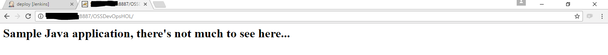

# 3 Creating the jenkins workflow
## 3.1 Creating the Build 
1. Go to the Jenkins Dashboard and click on "New Item".

2. Create a "Freestyle project" with the name "MavenBuid" and click "OK" to continue.
    

3. Configure the Github project and the Source Code Managment with your repository. For this lab we will use "https://github.com/karolikl/hol-oss-devops.git/"  

    
    
    
    
4. Click on the "Build" tab of the configuration. In the "Add build step" dropdown, select "Invoke top-level Maven targets".
   

   Click on the arrow next to the "Goals" textbox to expand the textbox to multiple lines. 
  
   Select the "Maven Version" we set up previously and specify the following goals for the build and click on the "Advanced..." button:
    ```
    clean
    package
    ``` 
   Add the following "POM" file path to the configuration:
    ```
    sample-app/pom.xml
    ``` 
5. Click on the "Build" tab of the configuration. In the "Add build step" dropdown, select "Exetute shell".
  
   In the Command section and add 
   
    ```
        ssh your-user@your-privateIP 'docker run -it --name demo1 -d -p 8888:8080 tomcat:8.0' 
    ``` 
   
6. Click on the "Post-build Actions" tab and add a post-build action of type "Archive the artifact" where you archive the files matching the following pattern:
      ```
    **/target/*.war
    ``` 
    

8. Click on "Save".


## 3.2 Creating the Deployment
1. Go to the Jenkins Dashboard and click on "New Item".

2. Create a "Freestyle project" with the name "Deploy" and click "OK" to continue.
    
    
3. Configure the Build triggers. Select "Build after other projects are build" and configure the "build" project

    
    
4. Click on the "Build" tab of the configuration. In the "Add build step" dropdown, select "Copy artifacts from another project".
 
   Fill the settings: 
   **Project name:** build
   **Wich version:** select Last succesfull build
   **Artifacts to copy:** **/target/*.war
   **Target directory:** $WORKSPACE

    

5. Click on the "Build" tab of the configuration. In the "Add build step" dropdown, select "Exetute shell".
  
   In the Command section and add 
   
    ```
        ssh your-user@your-privateIP 'docker cp  small_bassi:/var/jenkins_home/workspace/otro/sample-app/target/OSSDevOpsHOL.war .'
        ssh your-user@your-privateIP 'docker cp  /home/jessica/OSSDevOpsHOL.war demo1:/usr/local/tomcat/webapps/OSSDevOpsHOL.war'

    ``` 
    

6. Click on "Save".

## Running the Project

1. Run the build project to start the flow
2. Once the build and deploy finish browse to http://yourazurevmip:8888/OSSDevOpsHOL
